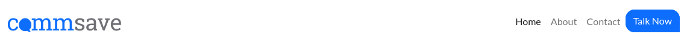
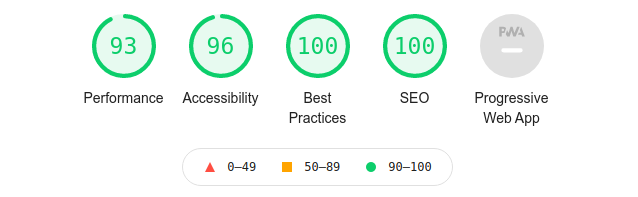

# CommSave

[You can view the live site here](https://r3b3l-dev.github.io/commsave-milestone1-ci/index.html)

# Project Overview

CommSave is a business website for an independant business telecoms consultancy. They offer companies a free and independant assessment of their communication requirements by examining their contracts,invoices and tarriffs to find ways of saving them money.

## Project Goals

The primary goal of the website is to act as a sales tool for prospective customers and to get  them to take action by requesting a meeting or phone conversation via the contact page of the site.

## Business Goals

The business goals of this website are:
- Act as a sales tool for prospective customers.
- Quickly articulate the services on offer.
- Answer high level questions about the services CommSave offer.
- Fill the funnel with net-new sales leads by getting the prospect to submit a contact form.
- Clean design with simple repetitive messaging to answe questions and build trust.

# User Experience

## User Goals

The user goals of this website are:
- To understand who CommSave are and what services they provide.
- To quickly see how the service will benefit the users business.
- To answer the question "How do i get this service?"

## Target Audience

- Small to medium size business in Ireland.
- Cutomers who do not have the expertise to audit complex billing scenarios.
- Customers who are performing a cost saving excercise / audit on overall costs.
- New Directors, Owners, Managers who are in a new role and wish to quickly assess their communications landscape. 

## User Stories

1. As a new user / potential customer i want to be able to quickly understand what type of business CommSave is and what service they offer.
2. As a new user / potential customer i want to understand how to work with CommSave and what steps i need to take to become a customer.
3. As a new user / potential customer i want to know what problems like minded customers are facing in their business.
4. As a new user / potential customer i want to understand why other customers use CommSave's service.
5. As a new user / potential customer i want to know how to contact CommSave.
6. As a new user / potential customer i want to learn further information abou who the management team are.
7. As a new user / potential customer i want to be able to schedule a sales call/meeting.

## Wireframe Mockups
- [Home](assets/readme-images/wireframe-home.png)
- [About](assets/readme-images/wireframe-about.png)
- [Contact](assets/readme-images/wireframe-contact.png)

# Website Features

The website is designed to quickly convey information and tell the **story** of CommSave. the main focus of the website is the long scroll page with multiple horizontal **blocked sections.** Each page features a responsive **navigation bar** with conventional placing of **logo** (top left) and a highlighted "Let's talk" call to action button in the top right. This features on every page.

## Home Page

## Logo & Navigation

- The navigation header is situated at the top of the page showing the company logo on the left which links to the homepage from all other pages.
- The navigation bar features three links: Home, About and Contact.
- The Call to Action button matchs the color of the brand and stands out against the white background. It is designed to make the user take action and has the text of "Talk Now" which features on all of the sites call to action buttons.

## The Hero Section

- The headline and sub-headline section of the home section is specific and concise 
- The call to action button which features throughout uses the same styling and colour.

## 3 Step Process

- A visual 3 step process that helps the user understand how to work with CommSave. Helps the customer understand what steps need to be taken to become a customer.

## The Value Stack Section

- This section gives a visual indication of 4 major business benefits for potential customers. 

## Problem

- This section quickly articulates the problems that a business faces when managing telecoms in house and then tells them how commSave can solve the problem.
- The image is visually striking in keeping with the brand and contrasts against the white background.
- The Call to Action button is placed underneath with a view to getting the user to take action after reading this section.

## Solution

- The solution sudy section gives the user a quick overview of how CommSave can help address the problems they face.
- The image is positive and reinforces the messaging of solving a problem.

## Why Us

- This section reinforces the value of doing business with commSave and highlights the key benefits and core values of commSave

## Footer

- Each page has a footer with contact information and social media icons linking to the companies social media accounts. 
- There is a description of the company and quick links to all pages.Contact information is also included.

## Explainer Video

- A company branded explainer video that can be used to highlight importnat info on both the team and company.

## Management Section

- This section gives an introduction and contact information for each of the management team.

## Form

- All of the CTA Talk Now buttons route to the contact page which includes this form. This form allows the user to submit their contact information in order to schedule a call.

# Testing

## Responsive

Responise testing for the website was completed using developer tools for sm, medium , large and xxl screen sizes.

## Links

All links were tested. External link opens in new page and internal links route to correct section / page.

## Form

The form was tested for the following;
- Requires an input on all fields marked as required.
- Email format is required for email input filed otherwise form will not submit. (Modal pop-up informs user)
- Submission works correctly. Modal needed as future feature.

## CSS

CSS - [W3C Markup Validation Service](https://validator.w3.org/) 

- Congratultations! No Error Found.

## HTML
HTML - [W3C Markup Validation Service](https://validator.w3.org/) 

- Document checking completed. No errors or warnings to show.

## Accessibility / SEO / Performance
Google lightouse was used to test for accessibility / seo /performance.

# Deployment

The project was deployed to github pages using the following steps;
  
  1. Once logged in to **Github**, navigate to the sites repository.
  2. Under repository name , click **Settings**.
  3. In the left sidebar, click **Pages** or scroll down to **Pages** section.
  4. Under Source, select **Master Branch** and hit **Save**.
  5. To see your published site, under **Github Pages**, click the sites url.

# Technologies Used
## Code Repository, Writing and Version Control
- GITPOD
- GITHUB 
- GIT

## Software
Favicon - [favicon.io](https://favicon.io/)

Logo - [Canva](https://canva.com)

File Format Conversion - [convertico.co](https://convertio.co/)

Wireframes - [Balsamiq](https://balsamiq.com/)

Images Resizing - [resizeimage.net](https://resizeimage.net/)

Fonts - [Google Fonts](https://fonts.google.com/)

Icons - [Font Awesome](https://fontawesome.com/)

Team Member Pictures - [Random User Generator](https://randomuser.me/)

Responive Screenshots - [Am I Responsive](http://ami.responsivedesign.is/)

Explainer Video - [Biteable.com](https://biteable.com)

## Framework and Languages

- HTML
- CSS
- JAVASCRIPT
- BOOTSTRAP 5.0

# Credits

## Website Images

Photo by [Fauxels](https://www.pexels.com/@fauxels?utm_content=attributionCopyText&utm_medium=referral&utm_source=pexels) on [Pexels](https://www.pexels.com/photo/photo-of-people-doing-handshakes-3183197/?utm_content=attributionCopyText&utm_medium=referral&utm_source=pexels)

Photo by [Icons8 Team](https://unsplash.com/@icons8?utm_source=unsplash&utm_medium=referral&utm_content=creditCopyText) on [Unsplash](https://unsplash.com/?utm_source=unsplash&utm_medium=referral&utm_content=creditCopyText)

Photo by [Kraken Images](https://unsplash.com/@krakenimages?utm_source=unsplash&utm_medium=referral&utm_content=creditCopyText) on [Unsplash](https://unsplash.com/s/photos/business-meeting?utm_source=unsplash&utm_medium=referral&utm_content=creditCopyText)

Photo by [Luis Villasmil](https://unsplash.com/@luisviol?utm_source=unsplash&utm_medium=referral&utm_content=creditCopyText) on [Unsplash](https://unsplash.com/?utm_source=unsplash&utm_medium=referral&utm_content=creditCopyText)

# Acknowledgements

Code reference for this project is from;

CSS Framework [Bootstrap](https://getbootstrap.com/docs/5.0/getting-started/introduction/)

CSS & HTML [W3Schools](https://www.w3schools.com/)

Framework Tutorial [Traversy Media](https://youtu.be/4sosXZsdy-s)

### Disclaimer
The content of this website is for educational purposes only.

